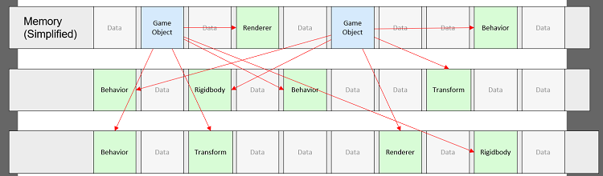
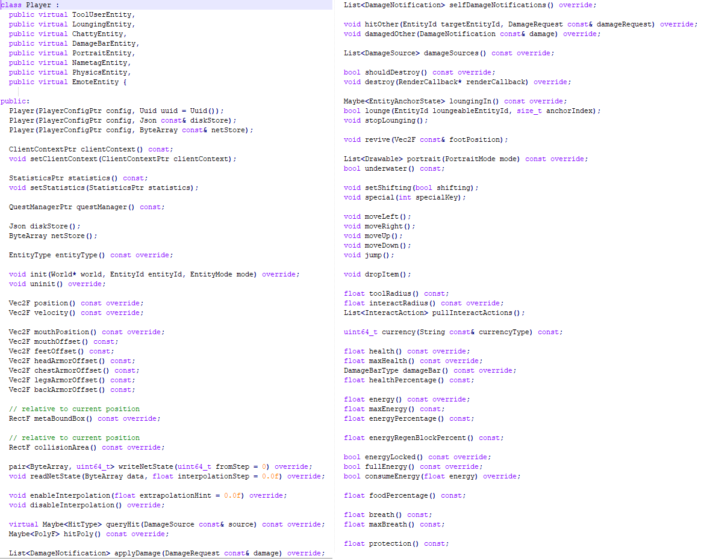
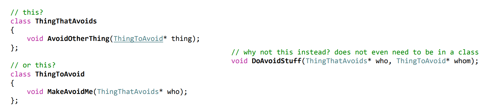
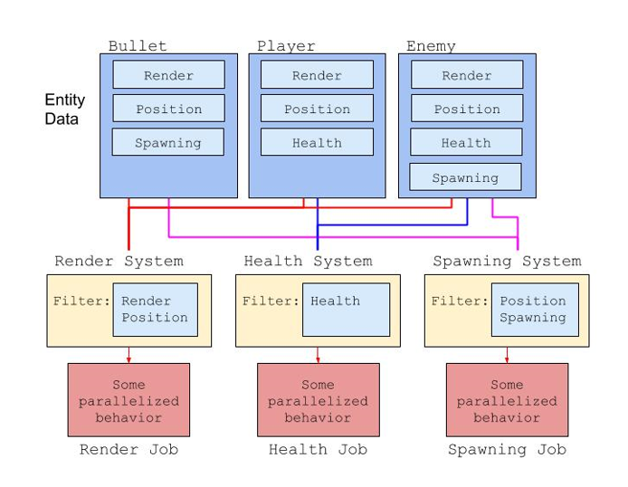

### Entity Component System

Ратков Макс

---

@snap[north headline span-80]
**Привычное ООП**
@snapend

@ul
- Объекты связаны друг с другом с помощью множества ссылок
- Данные и логика, их изменяющая, находятся в одном классе
@ulend

+++ 

@snap[north headline span-80]
**Производительность**
@snapend

- Объекты в памяти расположены хаотично


+++ 

@snap[north headline span-80]
**Толстые базовые классы**
@snapend

- Хочешь добавить новые фичи - скорее всего нужны новые поля/свойства


+++ 

@snap[north headline span-80]
**Неочевидно, где писать код**
@snapend

@ul
- Многие системы в играх не работают лишь с одним объектом
- Система избежания/обработки столкновений: куда вставлять логику?
@ulend

---

@snap[north headline span-80]
**Код и данные - вместе или раздельно?**
@snapend

@ul
- Типичный ООП: данные и методы над ними - в одном классе.
- Зачем?
@ulend

+++

@snap[north headline span-80]
Где написать код
@snapend

- Задача всех программ и всех частей этих программ - это трансформация данных из одной формы в другую

+++

@snap[north headline span-80]
**Данных - много**
@snapend

@ul
- Как часто вы встречаетесь с единственным экземпляром конкретной вещи?
- Во многих случаях идёт работа со многим количеством вещей
- А иногда их слишком много
- Можно работать не с каждой по отдельности, а со всеми сразу
@ulend

---

@snap[north headline span-80]
### Data Oriented Design!
@snapend

*ECS*:
@ul
- Entity
- Component
- System
@ulend

+++

@snap[north headline span-80]
**А как это? ОО стиль**
@snapend


+++

@snap[north headline span-80]
**А как это? ОО стиль**
@snapend

```csharp
class Person
{
    ContactDetails contactDetails;
    DateTime<Utc> dateOfBirths;
}

class ContactDetails { /* fields */ }
class DateTime<T> { /* fields */ }
```

+++

@snap[north headline span-80]
**А как это? ОО стиль**
@snapend

```csharp
class World
{
    Person[] people;
}
```
- Содержит *"массив cтруктур"* (Array of Structs)

+++

@snap[north headline span-80]
Разделим `Person` на части следующим образом:
@snapend

```csharp
class World
{
    ContactDetails[] contactDetails;
    DateTime<Utc>[] dateOfBirths;
}
```

@ul
- Каждый индекс в массивах представляет конкретного человека
- Теперь `World` - это *структура массивов* (Struct of Arrays)

+++

@snap[north headline span-80]
**А как это? EC стиль**
@snapend


- `Person` больше не существует физически, он является абстрактным понятием.
- Теперь `Person` - это вертикальный разрез двух массивов.

+++

@snap[north headline span-80]
**А как это? EC стиль**
@snapend


---

@snap[north headline span-80]
**Средний возраст**
@snapend

```
averageAge = totalAge / peopleCount
```

+++

@snap[north headline span-80]
**Средний возраст**
@snapend

```csharp
class Person
{
    ContactDetails contactDetails;
    DateTime<Utc> dateOfBirths;
}

Person[] people = /* ... */;
var now = /* текущий день */;

var meanAge = people
    .Select(person => yearsSince(person.dateOfBirths, now))
    .Sum() / people.Length;
```

+++

@snap[north headline span-80]
**Доступ к памяти**
@snapend

<table style="font-size: 0.6em;">
    <tr><td rowspan="3">P0</td><td rowspan="2" bgcolor="#eecc99">Contact Details</td><td bgcolor="#eecc99">Address</td></tr>
    <tr><td bgcolor="#eecc99">Phone Number</td></tr>
    <tr><td bgcolor="#eecc99">Date of Birth</td></tr>

    <tr><td rowspan="3">P1</td><td rowspan="2" bgcolor="#eecc99">Contact Details</td><td bgcolor="#eecc99">Address</td></tr>
    <tr><td bgcolor="#eecc99">Phone Number</td></tr>
    <tr><td bgcolor="#eecc99">Date of Birth</td></tr>

    <tr><td rowspan="3">P2</td><td rowspan="2" bgcolor="#eecc99">Contact Details</td><td bgcolor="#eecc99">Address</td></tr>
    <tr><td bgcolor="#eecc99">Phone Number</td></tr>
    <tr><td bgcolor="#eecc99">Date of Birth</td></tr>

    <tr><td rowspan="3">P3</td><td rowspan="2" bgcolor="#eecc99">Contact Details</td><td bgcolor="#eecc99">Address</td></tr>
    <tr><td bgcolor="#eecc99">Phone Number</td></tr>
    <tr><td bgcolor="#eecc99">Date of Birth</td></tr>
</table>

+++

@snap[north headline span-80]
**Доступ к памяти**
@snapend

<table style="font-size: 0.6em;">
    <tr><td rowspan="3">P0</td><td rowspan="2" bgcolor="#eecc99">Contact Details</td><td bgcolor="#eecc99">Address</td></tr>
    <tr><td bgcolor="#eecc99">Phone Number</td></tr>
    <tr><td bgcolor="#aaccff">Date of Birth</td></tr>

    <tr><td rowspan="3">P1</td><td rowspan="2" bgcolor="#eecc99">Contact Details</td><td bgcolor="#eecc99">Address</td></tr>
    <tr><td bgcolor="#eecc99">Phone Number</td></tr>
    <tr><td bgcolor="#aaccff">Date of Birth</td></tr>

    <tr><td rowspan="3">P2</td><td rowspan="2" bgcolor="#eecc99">Contact Details</td><td bgcolor="#eecc99">Address</td></tr>
    <tr><td bgcolor="#eecc99">Phone Number</td></tr>
    <tr><td bgcolor="#aaccff">Date of Birth</td></tr>

    <tr><td rowspan="3">P3</td><td rowspan="2" bgcolor="#eecc99">Contact Details</td><td bgcolor="#eecc99">Address</td></tr>
    <tr><td bgcolor="#eecc99">Phone Number</td></tr>
    <tr><td bgcolor="#aaccff">Date of Birth</td></tr>
</table>

---

@snap[north headline span-80]
**Средний возраст: Структура массивов**
@snapend

```csharp
ContactDetails[] contactDetails = /* ... */;
DateTime[] dateOfBirths = /* ...  */;
var world = new World() { contactDetails, dateOfBirths };

var now = /* текущий день */;

var mean_age = world
    .dateOfBirths
    .Select(date => yearsSince(date, now))
    .Sum() / world.dateOfBirths.Length
```

+++

@snap[north headline span-80]
**Доступ к памяти: Структура массивов**
@snapend

<table style="font-size: 0.6em;">
    <tr><td>D0</td><td bgcolor="#eecc99">Date of Birth</td></tr>
    <tr><td>D1</td><td bgcolor="#eecc99">Date of Birth</td></tr>
    <tr><td>D2</td><td bgcolor="#eecc99">Date of Birth</td></tr>
    <tr><td>D3</td><td bgcolor="#eecc99">Date of Birth</td></tr>
</table>

+++

@snap[north headline span-80]
**Доступ к памяти: Структура массивов**
@snapend

<table style="font-size: 0.6em;">
    <tr><td>D0</td><td bgcolor="#aaccff">Date of Birth</td></tr>
    <tr><td>D1</td><td bgcolor="#aaccff">Date of Birth</td></tr>
    <tr><td>D2</td><td bgcolor="#aaccff">Date of Birth</td></tr>
    <tr><td>D3</td><td bgcolor="#aaccff">Date of Birth</td></tr>
</table>

+++

@snap[north headline span-80]
**AOS vs SOA**
@snapend

```
name      aos ns/iter  soa ns/iter  diff ns/iter   diff %
avg_age   2,427,309    2,192,988        -234,321   -9.65%
avg_age   2,438,766    2,215,783        -222,983   -9.14%
avg_age   2,444,267    2,196,445        -247,822  -10.14%
avg_age   2,430,973    2,195,141        -235,832   -9.70%
avg_age   2,462,707    2,185,442        -277,265  -11.26%
avg_age   2,414,035    2,211,378        -202,657   -8.39%
avg_age   2,431,339    2,219,773        -211,566   -8.70%
avg_age   2,433,808    2,225,186        -208,622   -8.57%
avg_age   2,404,514    2,175,141        -229,373   -9.54%
avg_age   2,409,768    2,200,761        -209,007   -8.67%
```

+++


+++


---

#### Summarise



+++

Минусы:
- Сложность в осознании
- Трудно применить данный подход в ongoing проектах
- Оптимизирует отнюдь не всегда

Рекомендации:
- [Игровые фичи с помощью ECS: добавляем в шутер аптечки](https://habr.com/ru/company/pixonic/blog/431660/)
- [Unity3D College](https://www.youtube.com/channel/UCX_b3NNQN5bzExm-22-NVVg)

